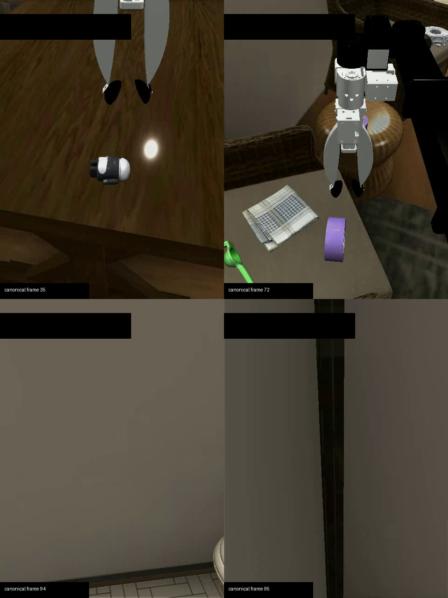

# FindingDory Object Attributes exact-B oracle gap v1

## 结论

**`GO`：FindingDory 满足作为 embodied multimodal-agent memory 扩展场景的三个前置条件。**
这个结论只覆盖公开 validation 的 `Object Attributes`，不是“任意 multimodal agent 都成立”的证据。

1. **公开 benchmark**：FindingDory 的论文、96-frame dataset 和 Habitat 代码均公开；本实验固定
   dataset revision `95afe1e8ef355e06f27000851fc4033266bdd480`。
2. **定性存在早期视觉信息丢失**：491 tasks 中，58.66% 至少有一个 valid frame 在轨迹前半段；
   29.12% 的全部 valid frames 都在前半段。`ep_1` 的 frame 72 清楚显示紫色圆柱纸卷，frame
   94/95 只见墙面；对应 purple/paper tasks 在 B1 Recent 失败而 Oracle 成功。见下图。
3. **定量 oracle gap 存在**：同一冻结 Qwen policy、同一 task-independent 压缩摘要、同一
   current frame 和同一 exact-$B$ 图像预算下，Oracle-B 显著优于 Recent-B；B1/B4 都通过冻结 gate。

## Full result

100 episodes、491 paired tasks、1,964 policy rows；冻结
`Qwen/Qwen2.5-VL-7B-Instruct@cc594898137f460bfe9f0759e9844b3ce807cfb5`。

| B | Recent HL-SR | Oracle HL-SR | Oracle − Recent | episode-bootstrap 95% CI | McNemar p | gate |
|---:|---:|---:|---:|---:|---:|:---:|
| 1 | 7.54% | 82.89% | +75.36 pp | [+70.47, +80.00] pp | 7.75e-110 | PASS |
| 4 | 5.50% | 44.20% | +38.70 pp | [+33.81, +43.64] pp | 6.15e-56 | PASS |

Gate 要求：Oracle HL-SR ≥ 30%、差值 ≥ 10 pp、clustered CI 下界 > 0、selection-difference
coverage ≥ 50%。B1/B4 coverage 分别为 100% / 97.96%。Pilot 只用于触发 expansion；`GO`
由 full 491-task result 决定。

这个 oracle 不是 FindingDory 论文的“理想 frame + teleport”Oracle：Recent/Oracle 两臂调用同一个
冻结 policy，policy 都可输出 0--95 中任意 frame；唯一差异是 exact-$B$ 中恢复哪几张历史图。因此它
直接验证的是预算条件化的 claim：

`s_theta(compressed history, task, current image, selected image set S), |S| = B`。

## Benchmark screening

官方 Table 4 的 Object Attributes 已报告理想 Oracle 99.80% / Text Agent 6.84%，可作为候选筛选，
但两者不是同一 policy、也没有控制恢复预算，不能单独证明本项目的 exact-$B$ claim；所以上面的
491-task paired run 才是 go/no-go 证据。

从公开 PDDL-valid answer groups 直接计算：最后一个 valid frame 距 current frame 95 的中位 age 为
26 帧；Recent-B 完全不含 valid frame 的 task 比例为 B1=99.39%、B4=89.41%、B8=79.84%、
B16=62.32%、B24=51.93%、B32=40.33%、B48=27.70%。这只证明“近期窗口常缺 witness”，不会
机械决定 policy 失败，因为 policy 仍可根据完整压缩摘要输出任意 0--95 frame。

`ep_1` 的两个直接 rescue case：

- purple object (`task_17`)：Recent-B1 选 frame 94、预测 40、失败；Oracle-B1 选 frame 72、
  预测 72、成功。
- paper object (`task_19`)：Recent-B1 选 frame 94、预测 88、失败；Oracle-B1 选 frame 72、
  预测 72、成功。

## Validity audit

审计覆盖 100 summary files / 1,200 chunks / 1,964 unique result keys。以下全部为 0：缺失或重复 key、
summary numeric/frame/time namespace、canonical chunk range、exact-$B$、selection-rule、Oracle 缺少
GT-valid evidence、answer group 和 success 重算不一致。

B4 出现的 `-1` 是 policy abstention（Recent 154、Oracle 105），不是 legacy frame-id 泄漏；真正的
out-of-domain prediction 为 0。B4 仍通过 gate，但其 Oracle SR 明显低于 B1，说明“多恢复图”会使这个
冻结 policy 更容易 abstain；不能从本实验推出 utility 随 B 单调增加。

两轮历史结果不得引用：首轮 summary 抄入 legacy frame id，标记
`INVALID_FRAME_ID_NAMESPACE`；第二轮恢复图仍带像素 overlay，标记
`INVALID_PIXEL_OVERLAY_NAMESPACE`。最终 run 在所有 summary/restored/current 图进入视觉塔前统一
mask `x=0..280, y=30..84`，并从 summary 开始重跑。

## Source of Truth

- 运行代码 commit：`fdf4a4a573bc4f10da0ca25d2b0c8f4b8492cb51`；审计代码 commit：
  `e01c934b7be3f7acc976831fee0391d1d41d1364`。
- Full metrics：[`summary.json`](summary.json)；pilot：[`pilot_summary.json`](pilot_summary.json)；
  validity：[`audit.json`](audit.json)；benchmark 静态分析：[`benchmark_screening.json`](benchmark_screening.json)。
- Protocol：[`docs/findingdory_object_attribute_oracle_gap_v1.md`](../../../docs/findingdory_object_attribute_oracle_gap_v1.md)；
  config：[`code/configs/findingdory_object_attribute_oracle_gap_v1.json`](../../../code/configs/findingdory_object_attribute_oracle_gap_v1.json)。
- Raw merged artifact（Hyper00）：
  `/data04/jaxan/runs/findingdory-object-attribute-oracle-gap-v1-masked-full-merge-fdf4a4a`。
- Worker roots：Hyper00
  `/data04/jaxan/runs/findingdory-object-attribute-oracle-gap-v1-masked-worker0-fdf4a4a`；Hyper01
  `/data04/jaxan/runs/findingdory-object-attribute-oracle-gap-v1-masked-worker1-fdf4a4a`。
- Raw rows、100 个 task-independent summaries 和视频 manifest 尚未上传 Hugging Face；状态：
  `PENDING_HF_UPLOAD`。预定 dataset repo：`gavinlaw/causalcache-findingdory-oracle-gap`，上传前以
  [`artifact_manifest.json`](artifact_manifest.json) 的路径和 SHA256 为准。

## 边界

Oracle 使用公开 PDDL-valid answer groups，是 privileged offline upper bound，不是可部署 selector。
这里的 `GO` 含义是：这个 benchmark 确实存在“早期高保真图比 Recent-B 更有条件价值”的可消费 headroom，
值得训练 selector；下一步才是仅根据 `(compressed history, task, current, B)` 预测恢复集合，并与
Recent-B、random/age-matched、text-only 及 GT Oracle 比较。
